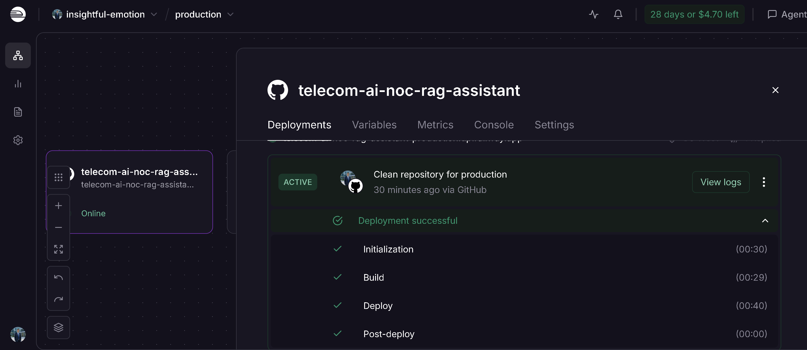

# 🚀 Telecom AI NOC RAG Assistant

> **Production-ready AI-powered Telecom Knowledge Assistant using Retrieval-Augmented Generation (RAG), FastAPI, ChromaDB, SentenceTransformers, OpenRouter, Docker, and Railway.**

<p align="center">


</p>

---

# 📖 Table of Contents

- Executive Summary
- Project Highlights
- Live Demo
- Business Value
- Why This Project?
- Key Features
- Solution Architecture
- Deployment Architecture
- AI Request Flow
- Project Structure
- Technology Stack
- Skills Demonstrated
- Production Deployment
- Project Screenshots
- Installation
- Environment Variables
- Build the Vector Database
- Running the Application
- Docker Deployment
- API Reference
- API Testing
- Engineering Decisions
- Project Achievements
- Lessons Learned
- Project Roadmap
- Future Enhancements
- Production Status
- FAQ
- About the Author
- Contact
- License
- Acknowledgements
- Version History

---

# Executive Summary

Telecom AI NOC RAG Assistant is a production-ready Retrieval-Augmented Generation (RAG) application designed to demonstrate how Artificial Intelligence can improve knowledge retrieval within telecommunications environments.

Instead of relying solely on a Large Language Model (LLM), the application performs semantic search against a domain-specific telecom knowledge base before generating an answer. This approach helps reduce hallucinations, improves factual accuracy, and ensures responses remain grounded in indexed technical documentation.

The project simulates an AI assistant for Network Operations Centre (NOC) engineers, enabling faster troubleshooting, improved operational efficiency, and quicker access to telecom knowledge.

This repository serves both as a practical AI engineering project and as a portfolio demonstration of modern backend development, semantic search, vector databases, cloud deployment, and telecom domain expertise.

---

# 🌟 Project Highlights

- ✅ Production-ready AI application
- ✅ Live cloud deployment on Railway
- ✅ Retrieval-Augmented Generation (RAG)
- ✅ ChromaDB vector database
- ✅ SentenceTransformers embeddings
- ✅ OpenRouter Large Language Model integration
- ✅ FastAPI REST API
- ✅ Docker containerization
- ✅ Interactive Swagger documentation
- ✅ Telecom-focused AI knowledge assistant
- ✅ Cloud-hosted production deployment
- ✅ Portfolio-ready architecture

---

# 🚀 Live Demo

The Telecom AI NOC RAG Assistant is publicly deployed and available for testing.

## Live Services

| Service | URL |
|---------|-----|
| Swagger UI | https://telecom-ai-noc-rag-assistant-production.up.railway.app/docs |
| Health Check | https://telecom-ai-noc-rag-assistant-production.up.railway.app/health |

## Deployment Platform

- Railway (Production)
- Docker
- FastAPI
- ChromaDB
- SentenceTransformers
- OpenRouter

The live deployment demonstrates a complete production-style Retrieval-Augmented Generation pipeline capable of answering telecom engineering questions using indexed documentation.

---

# 💼 Business Value

Modern telecommunications networks generate enormous volumes of operational procedures, alarm guides, vendor documentation, and engineering knowledge.

Searching this information manually is time-consuming, especially during critical incidents where rapid decision-making is essential.

Telecom AI NOC RAG Assistant demonstrates how Artificial Intelligence can enhance operational efficiency by combining semantic document retrieval with Large Language Models.

Potential business applications include:

- AI-assisted Network Operations Centres (NOC)
- Optical transport troubleshooting
- DWDM knowledge retrieval
- Telecom documentation search
- AI-powered engineer onboarding
- Enterprise knowledge management
- Intelligent operational support
- Technical document assistance

---

# Why This Project?

Telecommunications engineers frequently work with:

- Vendor manuals
- Standard Operating Procedures (SOPs)
- Alarm reference guides
- Maintenance procedures
- Configuration documentation
- Fault management documentation
- Optical transport references

Locating the correct information during live operations often requires searching through hundreds of pages of technical documentation.

Traditional keyword search frequently returns incomplete or irrelevant results.

Retrieval-Augmented Generation (RAG) addresses this challenge by retrieving the most semantically relevant content before asking the Large Language Model to generate a response.

This significantly improves answer quality while reducing AI hallucinations.

The result is a practical AI assistant capable of understanding telecom terminology and providing context-aware answers grounded in approved documentation.

---

# ✨ Key Features

- Retrieval-Augmented Generation (RAG)
- Telecom AI Knowledge Assistant
- FastAPI REST API
- Semantic Search
- ChromaDB Vector Database
- SentenceTransformers Local Embeddings
- OpenRouter LLM Integration
- Docker Support
- Railway Cloud Deployment
- Interactive Swagger Documentation
- Production-style Project Structure
- Modular Python Architecture
- Environment Variable Configuration
- AI-powered Telecom Question Answering
- Context-aware Responses
- Production-ready REST API

---

# 🏗 Solution Architecture

```text
                     User
                       │
                       ▼
               FastAPI REST API
                       │
                       ▼
                 RAG Service
                       │
        ┌──────────────┴──────────────┐
        │                             │
        ▼                             ▼
SentenceTransformers             ChromaDB
(Local Embeddings)         (Vector Database)
        │                             │
        └──────────────┬──────────────┘
                       │
                       ▼
                 OpenRouter API
                       │
                       ▼
             Large Language Model
                       │
                       ▼
               AI Generated Answer
```

---

# 🌐 Deployment Architecture

```text
                    Railway Cloud
                           │
                           ▼
                  Docker Container
                           │
                           ▼
                 FastAPI Application
                           │
                           ▼
                   RAG Processing Layer
                ┌──────────┴──────────┐
                │                     │
                ▼                     ▼
      SentenceTransformers        ChromaDB
      (Embeddings)            (Vector Store)
                │                     │
                └──────────┬──────────┘
                           ▼
                    OpenRouter API
                           │
                           ▼
                  Large Language Model
                           │
                           ▼
                    AI Generated Answer
```

The application is deployed on **Railway** inside a Docker container and exposes a production-ready REST API. The complete Retrieval-Augmented Generation (RAG) pipeline runs in the cloud and can be accessed through FastAPI and Swagger UI.

---

# 🤖 AI Request Flow

```text
User Question
      │
      ▼
POST /chat
      │
      ▼
Input Validation
      │
      ▼
Generate Embedding
      │
      ▼
Semantic Search
      │
      ▼
Retrieve Relevant Documents
      │
      ▼
Build Prompt
      │
      ▼
OpenRouter LLM
      │
      ▼
Generate Context-Aware Answer
      │
      ▼
Return JSON Response
```

This workflow demonstrates how Retrieval-Augmented Generation combines semantic document retrieval with a Large Language Model to produce accurate, context-aware responses.

---

# 📁 Project Structure

```text
telecom-ai-noc-rag-assistant/
│
├── app/
│   ├── core/
│   ├── rag/
│   ├── services/
│   ├── utils/
│   ├── api.py
│   ├── cli_chat.py
│   └── main.py
│
├── architecture/
├── config/
├── data/
├── docs/
├── images/
├── prompts/
├── tests/
│
├── Dockerfile
├── requirements.txt
├── README.md
├── LICENSE
├── .env.example
└── .gitignore
```

---

## 📂 Folder Overview

| Folder | Purpose |
|---------|---------|
| **app** | Main application source code |
| **core** | Input validation and configuration |
| **rag** | Retrieval-Augmented Generation pipeline |
| **services** | OpenRouter and AI services |
| **utils** | Logging and utility functions |
| **architecture** | Solution diagrams |
| **docs** | Supporting documentation |
| **images** | Screenshots and architecture images |
| **prompts** | AI prompt templates |
| **tests** | Testing resources |
| **data** | Telecom documentation and vector database |

---

# 💻 Technology Stack

| Layer | Technology |
|--------|------------|
| Programming Language | Python 3.12 |
| API Framework | FastAPI |
| Data Validation | Pydantic |
| AI Framework | Retrieval-Augmented Generation (RAG) |
| Embedding Model | SentenceTransformers (all-MiniLM-L6-v2) |
| Vector Database | ChromaDB |
| Large Language Model | OpenRouter |
| LLM Client | OpenAI SDK |
| Documentation | Swagger / OpenAPI |
| Containerisation | Docker |
| Cloud Deployment | Railway |
| Version Control | Git & GitHub |

---

# 🛠 Skills Demonstrated

## Artificial Intelligence

- Retrieval-Augmented Generation (RAG)
- Semantic Search
- Prompt Engineering
- Vector Embeddings
- Context-Aware AI
- LLM Integration

---

## Backend Development

- Python
- FastAPI
- REST APIs
- JSON Processing
- Pydantic
- Modular Architecture

---

## AI Infrastructure

- ChromaDB
- SentenceTransformers
- OpenRouter
- Docker
- Railway
- Environment Variables

---

## Software Engineering

- Clean Project Structure
- API Design
- Git
- GitHub
- Technical Documentation
- Cloud Deployment

---

## Telecom Domain

- DWDM
- Optical Transport
- NOC Operations
- Alarm Analysis
- Telecom Documentation
- Knowledge Management

---

# 🚀 Production Deployment

The project has been successfully deployed as a production-ready cloud application.

## Deployment Platform

| Component | Technology |
|-----------|------------|
| Cloud Platform | Railway |
| Container | Docker |
| API | FastAPI |
| AI Model | OpenRouter |
| Embeddings | SentenceTransformers |
| Vector Store | ChromaDB |

---

## Production Features

- Public REST API
- Swagger Documentation
- Health Check Endpoint
- Docker Deployment
- Cloud Hosting
- Environment Variables
- Production Logging
- Modular Architecture

---

## Deployment Benefits

The production deployment demonstrates:

- Cloud-native AI application development
- Containerized deployment
- Public API hosting
- End-to-end RAG implementation
- Production-ready software engineering practices
- Real-world AI integration

---

# 📸 Project Screenshots

The following screenshots demonstrate the application running in a production environment.

---

## 🌐 Swagger UI

Interactive API documentation automatically generated by FastAPI.

**Highlights**

- Live API testing
- Request validation
- OpenAPI documentation
- JSON request and response examples


---

## 🤖 AI Response

Example of a successful Retrieval-Augmented Generation (RAG) response.

The assistant retrieves the most relevant telecom documentation before generating an AI-powered answer.


---

## 🚀 Railway Deployment

Production deployment hosted on Railway.

Features demonstrated:

- Public REST API
- Cloud deployment
- Docker container
- Live production environment



---

## 🏗 Solution Architecture

Overall architecture illustrating the interaction between FastAPI, SentenceTransformers, ChromaDB, OpenRouter, and the Large Language Model.


---

## 📁 Project Structure

Project folder organization following a modular production-style architecture.


---

# ⚙ Installation

## Prerequisites

Before running the project, ensure the following software is installed:

- Python 3.12 or later
- Git
- Docker (Optional)
- VS Code (Recommended)

---

## Clone the Repository

```bash
git clone https://github.com/<YOUR_GITHUB_USERNAME>/telecom-ai-noc-rag-assistant.git

cd telecom-ai-noc-rag-assistant
```

---

## Create a Virtual Environment

### Windows

```bash
python -m venv .venv

.venv\Scripts\activate
```

### Linux / macOS

```bash
python3 -m venv .venv

source .venv/bin/activate
```

---

## Install Dependencies

```bash
pip install --upgrade pip

pip install -r requirements.txt
```

---

# 🔐 Environment Variables

Create a file named:

```text
.env
```

Example configuration:

```env
OPENROUTER_API_KEY=your_openrouter_api_key

OPENROUTER_MODEL=google/gemma-4-26b-a4b-it

CHROMA_DB_PATH=data/chromadb
```

> **Security Note**
>
> Never commit your `.env` file to GitHub.
>
> Only commit `.env.example`.

---

# 📚 Build the Vector Database

Whenever telecom documents are added or updated, rebuild the vector database.

Run:

```bash
python -m app.rag.vector_store
```

Expected output:

```text
Old collection deleted.

Indexed XXX chunks successfully.
```

---

# ▶ Running the Application

Start FastAPI:

```bash
uvicorn app.main:app --reload
```

The application will start on:

```text
http://127.0.0.1:8000
```

Swagger UI:

```text
http://127.0.0.1:8000/docs
```

Health Check:

```text
http://127.0.0.1:8000/health
```

---

# 🚀 Railway Deployment

Production Deployment

Swagger

```text
https://telecom-ai-noc-rag-assistant-production.up.railway.app/docs
```

Health

```text
https://telecom-ai-noc-rag-assistant-production.up.railway.app/health
```

---

# 🐳 Docker

## Build Docker Image

```bash
docker build -t telecom-ai-noc-rag-assistant .
```

---

## Run Docker Container

```bash
docker run -p 8000:8000 telecom-ai-noc-rag-assistant
```

Open:

```text
http://localhost:8000/docs
```

---

# 📡 REST API

## Available Endpoints

| Method | Endpoint | Description |
|---------|----------|-------------|
| GET | `/` | Welcome endpoint |
| GET | `/health` | Health check |
| POST | `/chat` | AI Telecom Assistant |

---

## POST /chat

Accepts a telecom engineering question and returns a context-aware AI response generated using Retrieval-Augmented Generation.

---

## Example Request

```json
{
    "question":"What is a Loss of Signal (LOS) alarm in DWDM?"
}
```

---

## Example Response

```json
{
    "question":"What is a Loss of Signal (LOS) alarm in DWDM?",
    "answer":"A Loss of Signal (LOS) alarm indicates that the receiving equipment is no longer detecting an incoming optical signal. It is commonly caused by fibre cuts, transmitter failures, connector issues or excessive optical attenuation."
}
```

---

# 🧪 Testing the API

### Using Swagger

1. Open Swagger UI

```
/docs
```

2. Expand

```
POST /chat
```

3. Click

```
Try it out
```

4. Enter a telecom engineering question.

5. Click

```
Execute
```

6. Review the generated response.

---

## Sample Questions

- What is DWDM?
- Explain Loss of Signal alarm.
- What causes high BER?
- Explain Optical Power.
- What is Optical Line Amplifier?
- Explain OTN.
- What causes Fibre Cut alarms?
- What is Optical Attenuation?
- Explain EDFA.
- What is Wavelength Multiplexing?

---

# 🏗 Engineering Decisions

This project was intentionally designed using a modern Retrieval-Augmented Generation (RAG) architecture to produce accurate, context-aware responses while reducing hallucinations commonly associated with Large Language Models.

Rather than asking an LLM to answer purely from its pre-trained knowledge, the assistant first retrieves the most relevant telecom documentation and then uses that context to generate the final response.

This design provides significantly higher accuracy for domain-specific technical questions.

---

## Why Retrieval-Augmented Generation (RAG)?

Large Language Models are powerful but have important limitations:

- They may hallucinate facts.
- They do not know your internal documentation.
- They cannot automatically learn newly published telecom procedures.

Retrieval-Augmented Generation solves these problems by combining semantic document retrieval with generative AI.

### RAG Workflow

```
User Question
      │
      ▼
Semantic Search
      │
      ▼
Retrieve Relevant Documents
      │
      ▼
LLM receives Context
      │
      ▼
Generate Grounded Response
```

### Benefits

- Reduced hallucinations
- Context-aware answers
- Updatable knowledge base
- No model retraining required
- Better explainability
- Enterprise-ready architecture

---

# Why FastAPI?

FastAPI was selected because it provides a modern framework for building production-grade REST APIs.

Advantages include:

- High performance
- Automatic OpenAPI documentation
- Interactive Swagger UI
- Built-in request validation
- Strong typing with Pydantic
- Excellent developer experience

---

# Why ChromaDB?

A Retrieval-Augmented Generation application requires a vector database.

ChromaDB was selected because it offers:

- Lightweight deployment
- Fast semantic similarity search
- Local storage
- Python-native integration
- Easy maintenance
- No external database server required

This makes it particularly suitable for AI prototypes and production-ready portfolio projects.

---

# Why SentenceTransformers?

The project uses:

```
all-MiniLM-L6-v2
```

Reasons for selecting this model:

- Runs locally
- Fast inference
- Small memory footprint
- High-quality semantic embeddings
- No embedding API cost
- Widely adopted within the AI community

Using local embeddings also simplifies deployment because the application is independent of third-party embedding services.

---

# Why OpenRouter?

OpenRouter provides a unified interface to multiple Large Language Models through a single API.

Benefits include:

- OpenAI-compatible SDK
- Easy model switching
- Access to multiple providers
- Cost flexibility
- Rapid experimentation
- Simplified configuration

Replacing the model requires only changing an environment variable rather than rewriting application logic.

---

# Why Docker?

Containerisation ensures that the application behaves consistently across development and production environments.

Docker provides:

- Environment consistency
- Reproducible deployments
- Dependency isolation
- Cloud portability
- Simplified deployment process

The same container image can be deployed locally or on cloud platforms such as Railway.

---

# Why Railway?

Railway was selected as the deployment platform because it provides a straightforward workflow for containerized Python applications.

Key advantages:

- Automatic GitHub deployments
- Docker support
- Environment variable management
- Public HTTPS endpoints
- Production-ready hosting
- Simple developer experience

The project is publicly deployed, allowing anyone to interact with the API through Swagger.

---

# AI Design Decisions

Several deliberate design decisions were made throughout development.

## Local Embeddings

Embedding generation is performed locally using SentenceTransformers rather than through a hosted API.

Advantages:

- Lower operating cost
- Faster document indexing
- Reduced external dependencies
- Greater deployment flexibility

---

## External LLM

Only the response generation step is delegated to the Large Language Model.

This hybrid architecture provides an effective balance between:

- Performance
- Cost
- Accuracy
- Maintainability

---

## Modular Architecture

The application is divided into logical components.

```
API
│
├── Core
├── RAG
├── Services
├── Utilities
└── Configuration
```

This improves:

- Readability
- Testing
- Maintainability
- Future scalability

---

# Security Considerations

The project follows several security best practices.

## Environment Variables

Sensitive configuration such as API keys is stored in environment variables.

Examples include:

- OPENROUTER_API_KEY
- OPENROUTER_MODEL
- CHROMA_DB_PATH

No secrets are committed to the repository.

---

## Input Validation

FastAPI and Pydantic validate incoming requests before processing.

This helps prevent malformed requests and improves API reliability.

---

## Container Isolation

Docker isolates the application and its dependencies, reducing environment-specific issues.

---

# Performance Considerations

Several optimisations improve performance.

## Local Embedding Generation

Avoids repeated external API calls.

---

## ChromaDB Vector Search

Retrieves only the most relevant document chunks.

---

## Context Limiting

Only the highest-ranked chunks are included in the LLM prompt.

Benefits:

- Faster responses
- Reduced token usage
- Lower inference cost

---

## Modular Processing Pipeline

Each stage performs one responsibility:

1. Validate input
2. Generate embeddings
3. Search vector database
4. Build prompt
5. Query LLM
6. Return response

This simplifies debugging and future enhancements.

---

# Design Principles

This project was developed following several engineering principles:

- Simplicity over unnecessary complexity
- Modular design
- Production readiness
- Cloud-first deployment
- Maintainability
- Domain-specific AI
- Reusable architecture
- Clear separation of concerns

---

# Skills Demonstrated

This repository demonstrates practical experience across multiple disciplines.

## Artificial Intelligence

- Retrieval-Augmented Generation (RAG)
- Semantic Search
- Vector Databases
- Prompt Engineering
- Large Language Models
- Embedding Models

---

## Backend Engineering

- FastAPI
- REST APIs
- Python
- JSON Processing
- Pydantic
- Modular Design

---

## AI Infrastructure

- Docker
- Railway
- ChromaDB
- SentenceTransformers
- OpenRouter
- Environment Management

---

## Telecommunications

- DWDM
- Optical Transport
- NOC Operations
- Alarm Analysis
- Knowledge Management
- Telecom Documentation

---

# 🏆 Project Achievements

This project successfully demonstrates the end-to-end implementation of a production-ready AI application for the telecommunications domain.

### Technical Achievements

- Production deployment on Railway
- Docker containerization
- FastAPI REST API development
- Retrieval-Augmented Generation (RAG)
- ChromaDB vector database integration
- Local semantic embeddings using SentenceTransformers
- OpenRouter Large Language Model integration
- Interactive Swagger/OpenAPI documentation
- Environment-based configuration
- Modular and maintainable project architecture

### Business Achievements

- Demonstrates AI-assisted telecom knowledge retrieval
- Reduces time spent searching technical documentation
- Improves access to operational procedures
- Provides a practical example of enterprise AI adoption
- Serves as a portfolio-ready AI engineering project

---

# 📚 Lessons Learned

Developing this project provided valuable practical experience across AI engineering, cloud deployment, and backend development.

Key lessons include:

- Designing Retrieval-Augmented Generation systems
- Building semantic search pipelines
- Working with vector databases
- Creating production REST APIs using FastAPI
- Integrating Large Language Models
- Docker containerization
- Cloud deployment using Railway
- Managing environment variables securely
- Debugging production deployments
- Structuring maintainable Python projects

Perhaps the biggest lesson was understanding that successful AI systems depend not only on the language model itself but also on well-designed retrieval, context management, and deployment architecture.

---

# 📈 Project Metrics

| Metric | Value |
|---------|------:|
| Programming Language | Python |
| API Framework | FastAPI |
| Vector Database | ChromaDB |
| Embedding Model | all-MiniLM-L6-v2 |
| LLM Provider | OpenRouter |
| Deployment Platform | Railway |
| Containerization | Docker |
| API Documentation | Swagger/OpenAPI |
| Deployment Status | Production |
| Domain | Telecommunications |

---

# 🚀 Project Roadmap

| Version | Status | Description |
|----------|--------|-------------|
| v1.0 | ✅ Completed | Initial RAG implementation |
| v2.0 | ✅ Completed | Migration from Azure OpenAI to OpenRouter |
| v2.1 | ✅ Completed | Railway production deployment |
| v3.0 | 🔄 Planned | Source citations |
| v3.1 | 🔄 Planned | Conversation memory |
| v3.2 | 🔄 Planned | Hybrid semantic + keyword search |
| v3.3 | 🔄 Planned | Authentication |
| v3.4 | 🔄 Planned | CI/CD pipeline |
| v4.0 | 🔄 Planned | Kubernetes deployment |

---

# 🚀 Future Enhancements

Potential future improvements include:

- Multi-document knowledge bases
- Source citations
- Streaming AI responses
- Conversation history
- User authentication
- Role-based access control
- Hybrid search
- Re-ranking retrieved documents
- Knowledge base management interface
- Monitoring and analytics dashboard
- CI/CD automation
- Kubernetes deployment
- Multi-tenant architecture

---

# ❓ Frequently Asked Questions

## What problem does this project solve?

It demonstrates how AI can improve telecom knowledge retrieval by combining semantic search with Large Language Models.

---

## Why use RAG instead of only an LLM?

RAG grounds responses in domain-specific documentation, reducing hallucinations and improving factual accuracy.

---

## Can additional documentation be added?

Yes.

Simply place new documents into the knowledge base and rebuild the vector database.

---

## Can another LLM be used?

Yes.

Changing the `OPENROUTER_MODEL` environment variable allows different compatible models to be used without modifying the application code.

---

## Is this project production ready?

Yes.

The project includes:

- Docker
- Railway deployment
- FastAPI
- Swagger
- Environment variables
- Modular architecture

making it suitable as a production-ready portfolio project.

---

# 👨‍💻 About the Author

## <PRIVATE_PERSON>

Telecommunications and AI Engineer with extensive experience in optical transport networks, network operations, and modern AI technologies.

This project reflects a practical approach to combining telecommunications expertise with Retrieval-Augmented Generation (RAG), semantic search, cloud deployment, and Large Language Models to build real-world AI solutions.

### Areas of Interest

- Artificial Intelligence
- Telecom AI
- Network Automation
- Retrieval-Augmented Generation (RAG)
- Large Language Models
- FastAPI
- Cloud Technologies
- Optical Transport Networks
- DWDM
- Intelligent Network Operations

### Current Focus

Building practical AI applications that solve operational challenges within telecommunications while expanding expertise in cloud-native AI systems and modern software engineering.

---

# 📬 Contact

Contributions, feedback, and collaboration are welcome.

GitHub:

```
https://github.com/<YOUR_GITHUB_USERNAME>
```

LinkedIn:

```
https://www.linkedin.com/in/<YOUR_LINKEDIN_PROFILE>
```

---

# 🎯 Interview Topics

This repository demonstrates practical knowledge of:

- Retrieval-Augmented Generation (RAG)
- Semantic Search
- Vector Databases
- ChromaDB
- SentenceTransformers
- FastAPI
- REST APIs
- Docker
- Railway Deployment
- OpenRouter
- Large Language Models
- Prompt Engineering
- Python
- Cloud Deployment
- Telecom AI Applications

---

# 🙏 Acknowledgements

This project builds upon several outstanding open-source technologies.

Special thanks to the communities behind:

- FastAPI
- ChromaDB
- SentenceTransformers
- Hugging Face
- OpenRouter
- Docker
- Railway
- Python

Their contributions make modern AI application development more accessible to developers worldwide.

---

# 📄 License

This project is licensed under the MIT License.

See the `LICENSE` file for details.

---

# 📝 Version History

## v2.1.0

### Added

- Railway production deployment
- Public Swagger API
- Health endpoint
- Production documentation
- Enhanced README
- Deployment architecture
- Engineering documentation
- Business value section
- Project metrics
- Professional portfolio documentation

### Improved

- OpenRouter integration
- Docker deployment
- API documentation
- Repository structure
- Cloud deployment
- Developer experience

### Previous Releases

**v2.0.0**

- Migrated from Azure OpenAI to OpenRouter
- Replaced Azure embeddings with SentenceTransformers
- Rebuilt ChromaDB vector database
- Restored FastAPI architecture

**v1.0.0**

- Initial Retrieval-Augmented Generation implementation

---

# ⭐ Final Notes

Telecom AI NOC RAG Assistant demonstrates how Retrieval-Augmented Generation (RAG), semantic search, vector databases, and Large Language Models can be combined to solve a real-world telecom knowledge retrieval problem.

The project showcases practical AI engineering, cloud deployment, REST API development, and modern software engineering practices while remaining focused on a realistic telecommunications use case.

It serves both as a learning resource and as a professional portfolio project demonstrating end-to-end AI application development.

If you found this project useful, please consider giving it a ⭐ on GitHub.

Thank you for visiting the repository.