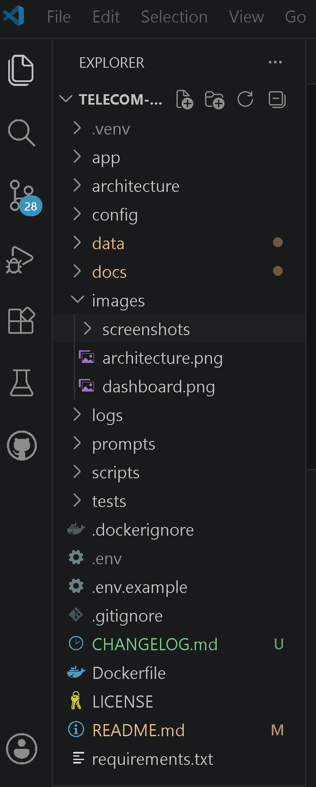
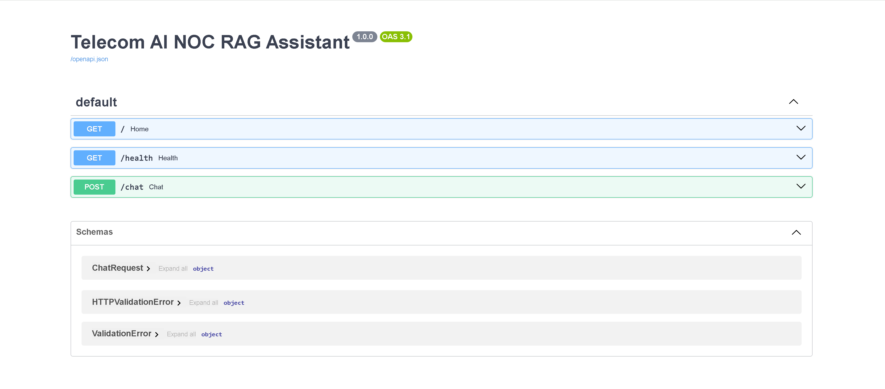

# 🚀 Telecom AI NOC RAG Assistant

> **An AI-powered Retrieval-Augmented Generation (RAG) Assistant for Telecom Network Operations Centers (NOC), built with FastAPI, ChromaDB, SentenceTransformers, and OpenRouter.**

<p align="center">


</p>

---

# 📖 Table of Contents

- Executive Summary
- Why This Project?
- Key Features
- Solution Architecture
- AI Request Flow
- Project Structure
- Technology Stack
- Screenshots
- Installation
- Environment Variables
- Building the Vector Database
- Running the Application
- API Documentation
- Example Request & Response
- Engineering Decisions
- Skills Demonstrated
- Roadmap
- Future Improvements
- License
- Author

---

# Executive Summary

Telecom AI NOC RAG Assistant is a production-style Retrieval-Augmented Generation (RAG) application designed to assist telecom engineers in searching operational documentation using Artificial Intelligence.

Instead of relying only on a Large Language Model (LLM), the application retrieves the most relevant technical documentation using semantic vector search before generating a response. This approach improves response quality, reduces hallucinations, and keeps answers grounded in the indexed telecom knowledge base.

The project demonstrates how modern AI technologies can enhance Telecom Network Operations Centres (NOC) by reducing document search time, improving troubleshooting efficiency, and accelerating access to operational knowledge.

---

# Why This Project?

Telecommunications engineers regularly work with:

- Vendor documentation
- Network operation procedures
- Troubleshooting guides
- Alarm manuals
- Standard Operating Procedures (SOPs)
- Configuration references

Finding the correct information quickly can be difficult, particularly during live network incidents.

This project demonstrates how Retrieval-Augmented Generation (RAG) can improve operational efficiency by combining semantic search with Large Language Models to produce accurate, context-aware answers based on approved documentation.

---

# Key Features

✅ Retrieval-Augmented Generation (RAG)

✅ AI-powered Telecom Knowledge Assistant

✅ FastAPI REST API

✅ ChromaDB Vector Database

✅ Local SentenceTransformer Embeddings

✅ OpenRouter LLM Integration

✅ Semantic Vector Search

✅ Swagger/OpenAPI Documentation

✅ Modular Project Architecture

✅ Docker Ready

✅ Production-style Folder Structure

---

# Solution Architecture

```
                     User
                       │
                       ▼
               FastAPI REST API
                       │
                       ▼
                 RAG Service
                       │
        ┌──────────────┴──────────────┐
        │                             │
        ▼                             ▼
SentenceTransformers             ChromaDB
(Local Embeddings)         (Vector Database)
        │                             │
        └──────────────┬──────────────┘
                       │
                       ▼
                 OpenRouter API
                       │
                       ▼
             Large Language Model
                       │
                       ▼
               AI Generated Answer
```

---

# AI Request Flow

```
User Question
      │
      ▼
POST /chat
      │
      ▼
Validate Request
      │
      ▼
Generate Embedding
      │
      ▼
Semantic Vector Search
      │
      ▼
Retrieve Relevant Context
      │
      ▼
Construct Prompt
      │
      ▼
OpenRouter LLM
      │
      ▼
Generate AI Response
      │
      ▼
Return JSON Response
```

---

# Project Structure

```text
telecom-ai-noc-rag-assistant/
│
├── app/
│   ├── core/
│   ├── rag/
│   ├── services/
│   ├── api.py
│   ├── cli_chat.py
│   └── main.py
│
├── architecture/
├── config/
├── data/
├── docs/
├── images/
│   └── screenshots/
│
├── tests/
│
├── Dockerfile
├── requirements.txt
├── .env.example
├── README.md
└── LICENSE
```

### Folder Overview

| Folder | Description |
|---------|-------------|
| app | Main application source code |
| rag | Retrieval-Augmented Generation pipeline |
| services | LLM integration and orchestration |
| core | Validation and utility functions |
| architecture | Solution diagrams and design documents |
| docs | Project documentation |
| images | Screenshots and diagrams |
| tests | Unit and integration tests |
---

# 💻 Technology Stack

| Layer | Technology |
|--------|------------|
| Programming Language | Python 3.11+ |
| API Framework | FastAPI |
| Vector Database | ChromaDB |
| Embeddings | SentenceTransformers (`all-MiniLM-L6-v2`) |
| Large Language Model | OpenRouter |
| HTTP Client | OpenAI SDK |
| API Documentation | Swagger / OpenAPI |
| Containerisation | Docker |
| Version Control | Git & GitHub |

---

# 📸 Project Screenshots

## 📁 Project Structure

A modular production-ready project structure with clear separation of API, RAG pipeline, services, and supporting resources.



---

## 🌐 Swagger API Documentation

Interactive API documentation generated automatically by FastAPI.

Features include:

- Live API testing
- Request validation
- JSON schema
- Automatic documentation



---

## 🤖 AI Chat Response

Example of a successful Retrieval-Augmented Generation (RAG) response.

The assistant retrieves relevant telecom documentation before generating an AI response.


---

## 🏗 Solution Architecture

High-level architecture illustrating the interaction between FastAPI, SentenceTransformers, ChromaDB, OpenRouter, and the Large Language Model.


---

## 🐳 Docker Deployment *(Optional)*

Application running inside Docker.


---

# ⚙️ Installation

## Clone Repository

```bash
git clone https://github.com/YOUR_GITHUB_USERNAME/telecom-ai-noc-rag-assistant.git

cd telecom-ai-noc-rag-assistant
```

---

## Create Virtual Environment

Windows

```bash
python -m venv .venv

.venv\Scripts\activate
```

Linux / macOS

```bash
python3 -m venv .venv

source .venv/bin/activate
```

---

## Install Dependencies

```bash
pip install -r requirements.txt
```

---

# 🔐 Environment Variables

Create a `.env` file in the project root.

Example:

```env
OPENROUTER_API_KEY=your_openrouter_api_key_here

OPENROUTER_MODEL=openai/gpt-4.1-mini

CHROMA_DB_PATH=data/chromadb
```

> **Important:** Never commit your `.env` file. Only commit `.env.example`.

---

# 📚 Build the Vector Database

After adding or updating documents, rebuild the vector database:

```bash
python -m app.rag.vector_store
```

Expected output:

```text
Indexed XXX chunks successfully.
```

---

# ▶️ Run the Application

Start the FastAPI server:

```bash
uvicorn app.main:app --reload
```

The application will be available at:

```text
http://127.0.0.1:8000
```

Swagger UI:

```text
http://127.0.0.1:8000/docs
```

Health Check:

```text
http://127.0.0.1:8000/health
```

---

# 🐳 Docker

## Build Image

```bash
docker build -t telecom-ai-noc-rag-assistant .
```

---

## Run Container

```bash
docker run -p 8000:8000 telecom-ai-noc-rag-assistant
```

Open:

```text
http://localhost:8000/docs
```

---

# 📡 API Endpoints

| Method | Endpoint | Description |
|----------|----------|-------------|
| GET | `/` | Application welcome message |
| GET | `/health` | Health check |
| POST | `/chat` | Ask the AI assistant |

---

# 🧪 Example API Request

```json
{
    "question": "What is a Loss of Signal (LOS) alarm in DWDM?"
}
```

---

# ✅ Example API Response

```json
{
    "answer": "A Loss of Signal (LOS) alarm indicates that the receiving equipment is no longer detecting an incoming optical signal. It is commonly caused by fibre cuts, connector issues, transmitter failures, or excessive optical attenuation."
}
```

---

# 🔍 Testing the API

Using Swagger:

1. Open `/docs`
2. Expand **POST /chat**
3. Click **Try it out**
4. Enter a telecom-related question
5. Click **Execute**
6. Review the AI-generated response

The API returns structured JSON responses and automatically validates incoming requests.

---

# 🏗 Engineering Decisions

This project was intentionally designed using a modern Retrieval-Augmented Generation (RAG) architecture to provide accurate, context-aware responses while minimizing AI hallucinations.

## Why FastAPI?

- High-performance asynchronous Python framework
- Automatic OpenAPI/Swagger documentation
- Excellent developer experience
- Production-ready REST API support

---

## Why ChromaDB?

ChromaDB provides a lightweight vector database that is ideal for Retrieval-Augmented Generation applications.

Benefits include:

- Fast semantic similarity search
- Simple local deployment
- No external database required
- Easy integration with Python

---

## Why SentenceTransformers?

The project uses the **all-MiniLM-L6-v2** embedding model because it:

- Runs locally
- Produces high-quality semantic embeddings
- Eliminates embedding API costs
- Simplifies deployment
- Is widely adopted in production RAG systems

---

## Why OpenRouter?

OpenRouter provides a unified interface to multiple Large Language Models.

Advantages include:

- Model flexibility
- Cost efficiency
- OpenAI-compatible API
- Easy model switching without code changes

---

## Why Retrieval-Augmented Generation (RAG)?

Instead of relying solely on an LLM's pretrained knowledge, RAG retrieves relevant information from a domain-specific knowledge base before generating a response.

Benefits include:

- Reduced hallucinations
- More accurate answers
- Explainable responses
- Easy knowledge base updates without retraining

---

# 🧠 Skills Demonstrated

## Artificial Intelligence

- Retrieval-Augmented Generation (RAG)
- Semantic Search
- Vector Embeddings
- Prompt Engineering
- LLM Integration
- Context-Aware AI Systems

---

## Backend Development

- Python
- FastAPI
- REST APIs
- JSON Processing
- Pydantic Validation
- Modular Application Design

---

## AI Infrastructure

- ChromaDB
- SentenceTransformers
- OpenRouter
- Docker
- Environment Configuration

---

## Software Engineering

- Git
- GitHub
- Clean Architecture
- Documentation
- API Design
- Project Organisation

---

# 📈 Project Roadmap

| Version | Status | Description |
|----------|--------|-------------|
| v1.0 | ✅ Completed | Initial RAG implementation |
| v2.0 | ✅ Completed | Migrated from Azure OpenAI to OpenRouter |
| v3.0 | ✅ Completed | Production documentation and GitHub portfolio |
| v3.1 | 🔄 Planned | Source citations |
| v3.2 | 🔄 Planned | Conversation memory |
| v3.3 | 🔄 Planned | Hybrid keyword + semantic search |
| v3.4 | 🔄 Planned | Authentication and user management |
| v4.0 | 🔄 Planned | Cloud deployment with CI/CD |

---

# 🚀 Future Improvements

Planned enhancements include:

- Conversation memory
- Source citations
- Hybrid search
- Streaming responses
- Multi-document retrieval
- User authentication
- Role-based access
- Admin dashboard
- CI/CD with GitHub Actions
- Cloud deployment (Azure, Render, Railway)
- Monitoring and logging
- Performance benchmarking

---

# 📚 Lessons Learned

During development, the project evolved from an Azure OpenAI-based prototype into a more portable and cost-effective solution.

Key improvements included:

- Migrating from Azure OpenAI to OpenRouter
- Replacing cloud embeddings with local SentenceTransformers
- Rebuilding the ChromaDB vector database
- Separating the CLI chatbot from the FastAPI application
- Improving project structure for maintainability
- Enhancing documentation for open-source publication

These changes reduced infrastructure dependencies while making the project easier to run, maintain, and demonstrate.

---

# 🤝 Contributing

Contributions, suggestions, and improvements are welcome.

If you have ideas for new features or enhancements:

1. Fork the repository
2. Create a feature branch
3. Commit your changes
4. Open a Pull Request

---

# 📄 License

This project is licensed under the **MIT License**.

See the `LICENSE` file for details.

---

# 👨‍💻 Author

**<PRIVATE_PERSON>**

Telecommunications • Artificial Intelligence • Network Automation • Cloud Technologies

Areas of interest:

- Telecom AI
- AI Engineering
- Network Automation
- Intelligent Network Operations
- Cloud-native AI Applications

---

# 🙏 Acknowledgements

This project builds upon several outstanding open-source technologies:

- FastAPI
- ChromaDB
- SentenceTransformers
- OpenRouter
- Python
- Docker

Special thanks to the open-source community for making modern AI development accessible.

---

# 📝 Version History

## v3.0.0

### Added

- Professional project documentation
- Architecture diagrams
- Request flow diagrams
- Engineering decision documentation
- Portfolio-ready README
- Enhanced screenshots
- Skills and roadmap sections

### Improved

- Project structure
- Installation guide
- API documentation
- Developer experience

### Previous Major Release (v2.0.0)

- Migrated from Azure OpenAI to OpenRouter
- Replaced Azure embeddings with SentenceTransformers
- Rebuilt ChromaDB vector database
- Restored FastAPI architecture
- Added CLI chatbot
- Updated configuration and environment management

---

# ⭐ Final Notes

This repository demonstrates the design and implementation of a production-style AI application that combines semantic search, Retrieval-Augmented Generation (RAG), and Large Language Models to solve a real-world telecom knowledge retrieval problem.

It is intended as both a learning project and a portfolio piece showcasing modern AI engineering practices, modular backend development, and domain-specific AI integration.

If you found this project useful, consider giving it a ⭐ on GitHub.